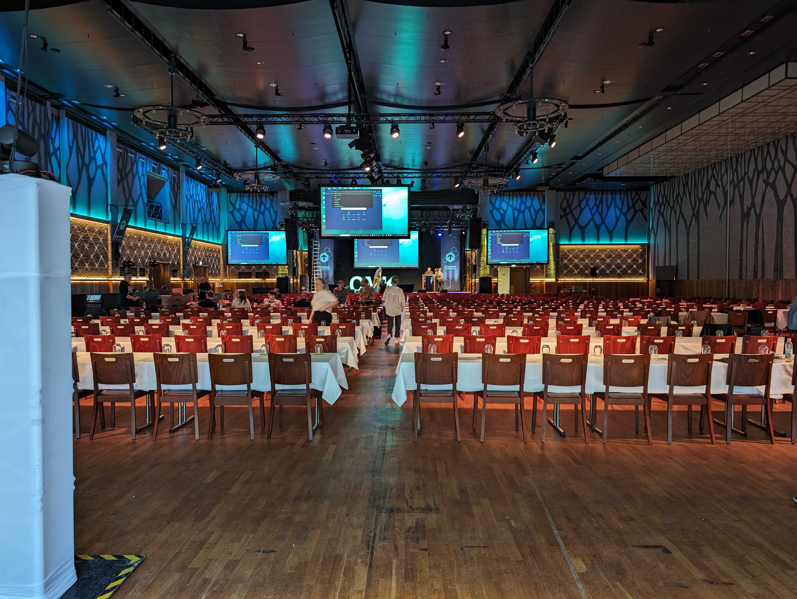
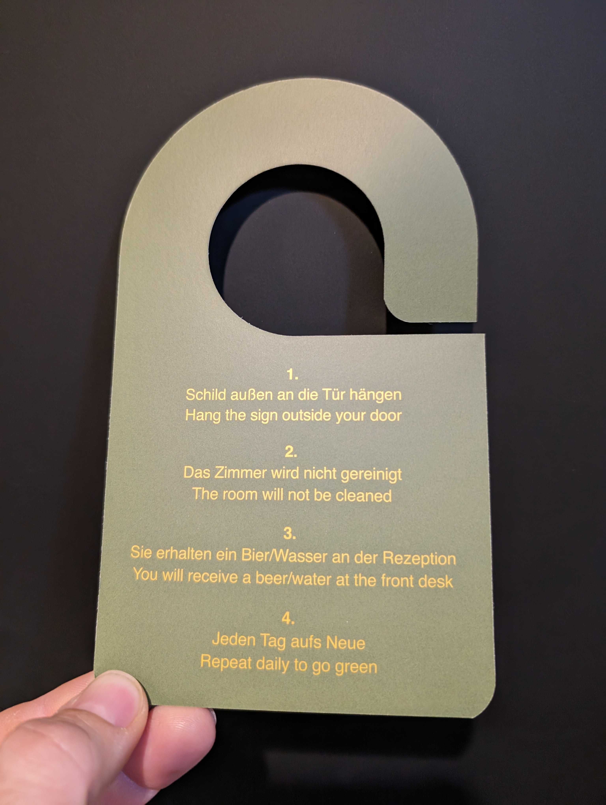

Arrived at Munchen today, and went to Paulaner am Nockherberg where the conference is held. 
Everyone giving a talk at the conferense had to check-in for a mic check and get af felling of the conference system used.

<!-- more -->

This also gave me the oppotunity to figure out the best route from the Hotel to the conference.
This year the hotel of choice was [gambino Hotel WERKSVIERTEL](https://gambinohotelwerksviertel.com/index.php/en/) only a short walk from the S-Bahn, really nice hotel clean and with a very nice streetfood area next door, and a feature I have never seen before but would hope more hotels would copy ;)

Looking forward to tomorrow.

/Sune