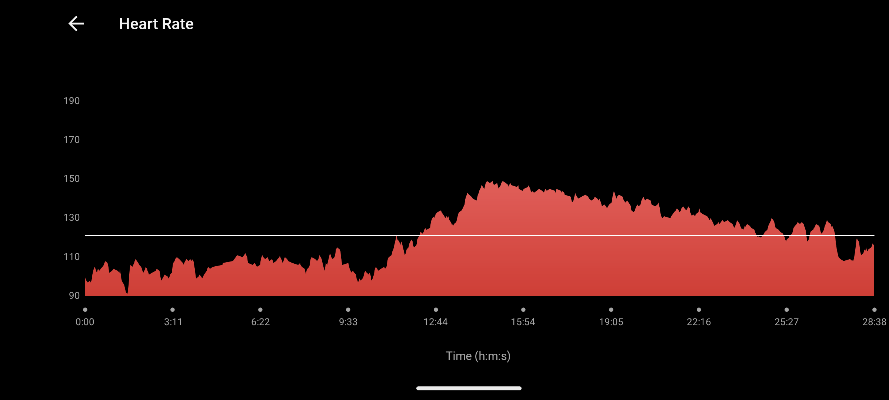

The day has come :)

This was really an exciting day, I did my talk in front of ~400 people in the room and ~700 livestreamers. Never have I talk to a croud this size. 
Seing that this is a conference with focus on monitoring I though I should do a little extra and monitor my heartrate in the minuts up to the talk and during.

I think the graf speaks for it self...

Besides the high pulse it actually went okay, I got good respons from the audience and the folks at Checkmk, shoutout to Martin (indsæt efternavn) the CPO from Checkmk to help make the slides. 